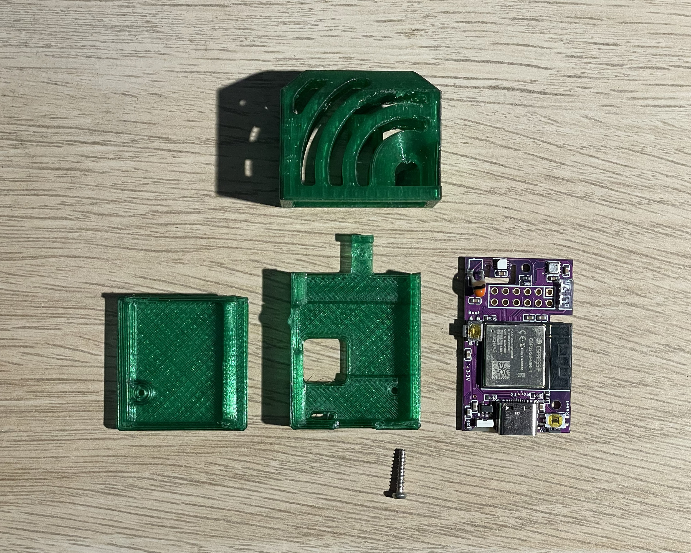

# OpenTenki 3D-Printed Case

The case consists of **three 3D-printed parts** that fit around the PCB and are
secured with a single **M2×10 plastic screw**.

You can also find this model on
[Printables](https://www.printables.com/model/1790374-opentenki-case).

## What you need

- The three `.stl` files in this folder
- An assembled OpenTenki PCB
- 1 × M2×10 plastic screw

## Print & assemble

1. Print the three STL files — standard PLA or PETG settings work fine.
2. Fit the PCB inside the case parts as shown in the picture above.
3. Close the case with the M2×10 screw. Done!

## Modifying the case

The case is designed in [Onshape](https://www.onshape.com/) and the full
assembly is included as a STEP file
([`3D_PCB2_2026-04-23.step`](3D_PCB2_2026-04-23.step)), so you are free to
modify or remix it as you wish.
