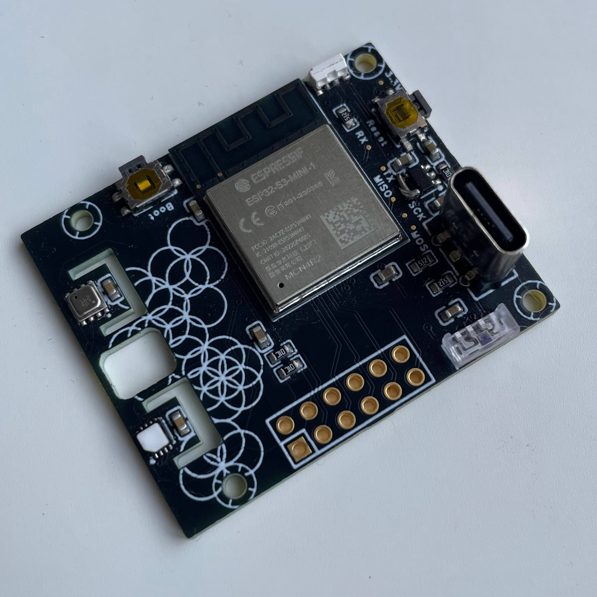

# OpenTenki PCB

The components i have chose are:
## Microcontroler
  ### ESP32-s3-mini N4R2
  This ic is great because with a small form-factor it has WiFi, Bluetooth, USB otg, 4Mb of Quad Flash, 2Mb of Quad PSRAM. And that compatible with EspHome, Tasmota, Arduino, CircuitPython and MicroPython.
  
## Sensors  
All conected with i2c, SDA on pin IO3 and SCL on pin IO4
  ### Bosch BME688 
  This is use to monitor the air quality as well as presure, temperature and humidity 
  ### VEML 7700 
  With this sensor you can monitor Ambient ligth, Infrared and full spectrum ligth, is a cheap a reliable option 
  ### HDH3022 
  This last sensor can measure temperature and humidity much more precise than the BME688 and is way cheaper so if you dont need the air quality or the atmosferic presure its a great way, is also usefull for more precise measuremnts

## Extras
  ### WS2812C on IO 33
  Usualy know as neopixel, this is a small status LED it can be use for anything but its primary use is in ESPHome as is code so it shows the boot status and also it shows if its coneccted to HA when the button is press
  ### Button on IO 0
  This can be use to boot the board in flash mode and also a user button to know the status or to send a signal to your server
