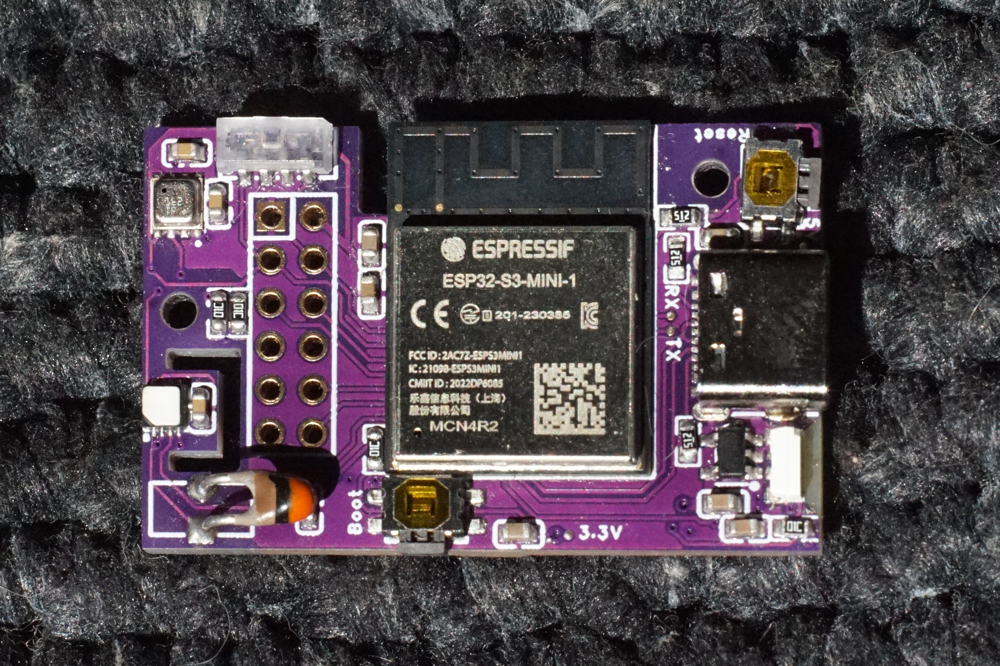

# OpenTenki PCB

## Files

- [`SchematicV2.pdf`](SchematicV2.pdf) — full schematic of the current revision.
- [`PCB_OpenTenki.pdf`](PCB_OpenTenki.pdf) — PCB layout preview.
- [`Gerber_PCB2_2026-04-26/`](Gerber_PCB2_2026-04-26) — production-ready Gerber
  and drill files. See `How-to-order-PCB.txt` inside for the EasyEDA ordering
  guide.
- [`OpenTenkiEasyEda.eprj`](OpenTenkiEasyEda.eprj) — full EasyEDA project, in case you want to modify the
  design.

## Components

### Microcontroller

#### ESP32-S3-mini N4R2

This module is great because, in a small form factor, it provides Wi-Fi,
Bluetooth, USB OTG, 4 MB of Quad Flash and 2 MB of Quad PSRAM. It is also
compatible with ESPHome, Tasmota, Arduino, CircuitPython and MicroPython.

### Sensors

All sensors are connected over I²C, with **SDA on GPIO3** and **SCL on GPIO4**.

#### Bosch BME688

Used to monitor air quality, as well as pressure, temperature and humidity.

#### VEML7700

Measures ambient light, infrared and full-spectrum light. A cheap and reliable
option.

#### HDC3022

This last sensor measures temperature and humidity much more precisely than the
BME688 and is significantly cheaper, so if you don't need air quality or
atmospheric pressure it's a great choice. It's also useful any time you want
more precise readings.

## Extras

### WS2812C on GPIO18

Usually known as a NeoPixel, this small status LED can be used for anything,
but its primary use is in ESPHome — the included configuration uses it to show
boot status and to confirm Home Assistant connectivity when the user button is
pressed.

### Button on GPIO0

Doubles as the bootloader button (to flash the board) and as a user button to
check status or to trigger an action on your server.
