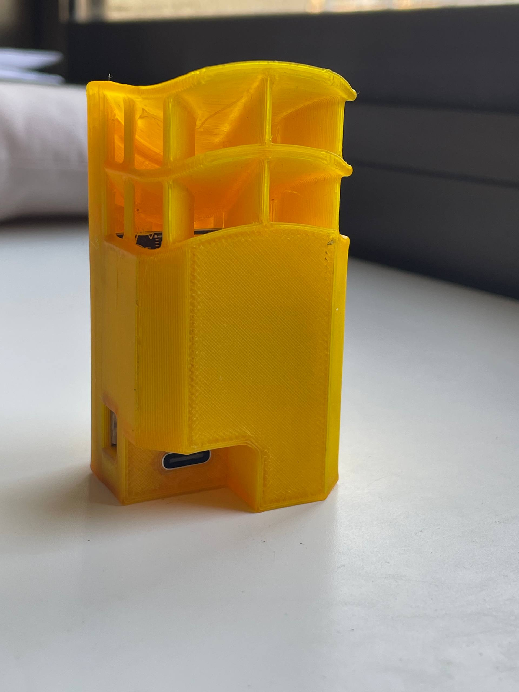

# OpenTenki 🚧Construction in progress🚧

OpenTenki is an open-source, affordable, and precise weather station hardware platform featuring an ESP32-S3 mini and multiple environmental sensors. It is designed for hobbyists and is compatible with ESPHome and Tasmota firmware, enabling easy integration with home automation systems via MQTT or Matter protocols.

---

## Features

- Accurate environmental sensing with:  
  - VEML7700 (ambient light sensor)  
  - BME688 (temperature, humidity, pressure, air quality)  
  - HDH3022 (Temperature, humidity)  
  - Neopixel for status indication  
  - User buttons for control  
- Based on ESP32-S3 mini for robust Wi-Fi connectivity  
- Fully open-source hardware and software  
- Designed for easy customization and extension  
- Supports MQTT and Matter protocols for data transmission  

---

## Getting Started

### Hardware Pending

- See the [schematics](link-to-schematics) and [PCB design files](link-to-pcb-files) in the `/hardware` directory.  
- Bill of Materials (BOM) is available in `/docs/BOM.md`.

### Firmware

- Compatible with [ESPHome](https://esphome.io/) and [Tasmota](https://tasmota.github.io/) out of the box.  
- Custom firmware in development — contributions welcome!

### Usage

1. Flash ESPHome or Tasmota firmware configured for OpenTenki sensors.  
2. Connect the board to power and Wi-Fi.  
3. Integrate sensor data with your home automation platform via MQTT or Matter.

---

## Contributing

Contributions, bug reports, and feature requests are more than welcome! Please open issues or pull requests on GitHub.

---

## License

OpenTenki is licensed under the Apache License 2.0. See [LICENSE](LICENSE) for details.

---

## Contact

For questions or discussions, open an issue or contact diegozalezz@gmail.com.
