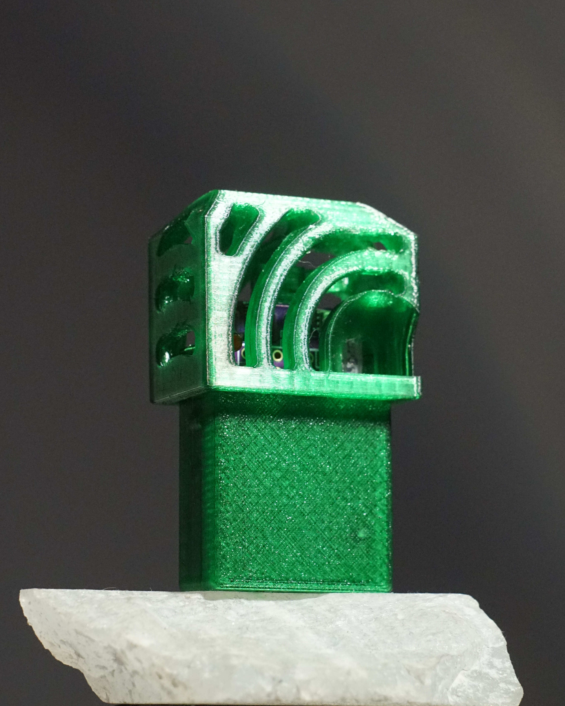
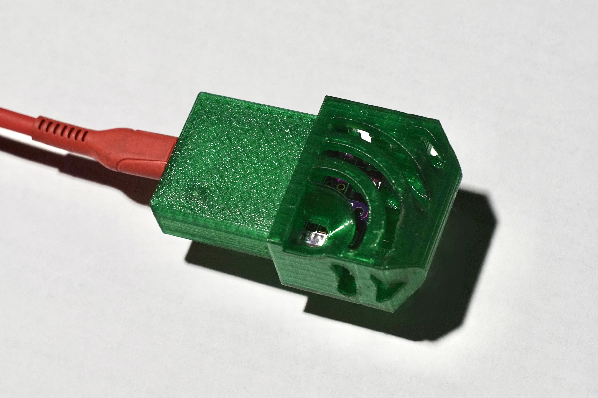

# OpenTenki 🚧 Construction in progress 🚧

<table>
  <tr>
    <td valign="middle">
      OpenTenki is an open-source, affordable, and precise indoor weather station
      hardware platform built around an ESP32-S3 mini and multiple environmental
      sensors. It is designed for hobbyists and is compatible with ESPHome and
      Tasmota firmware, enabling easy integration with home automation systems
      via MQTT or Matter.
    </td>
    <td valign="middle" width="50%">
      
    </td>
  </tr>
</table>

## Features

- Accurate environmental sensing with:
  - VEML7700 (ambient light, infrared and full-spectrum light)
  - BME688 (temperature, humidity, pressure, air quality)
  - HDC3022 (high-precision temperature and humidity)
  - WS2812C (NeoPixel) status LED
  - User button for control and feedback
- Based on the ESP32-S3 mini for robust Wi-Fi and Bluetooth connectivity
- Fully open-source hardware and software
- Designed for easy customization and extension
- Supports MQTT and Matter protocols for data transmission

---

## Repository Structure

- [`PCB/`](PCB) — Schematic, Gerber files, BOM, EasyEDA project and PCB renders
- [`Code/`](Code) — Firmware integrations (ESPHome, Tasmota, more coming)
- [`Case3D/`](Case3D) — 3D-printable case files
- [`Media/`](Media) — Photos and renders of the board and case

---

## Getting Started

### Hardware

- Order the PCB with the [Gerber files](PCB/Gerber_PCB2_2026-04-26) and the
  [BOM](PCB/BOM_OpenTenki_PCB2_2026-07-24.xlsx) — see the [`PCB/`](PCB) folder
  for the schematic, the interactive BOM and the full EasyEDA project.
- 3D-print the [case](Case3D): three printed parts and one screw.

### Firmware

- Compatible with [ESPHome](https://esphome.io/) and
  [Tasmota](https://tasmota.github.io/) out of the box.
- Custom firmware (Arduino, etc.) is in development — contributions welcome!

### Usage

1. Flash ESPHome or Tasmota firmware configured for OpenTenki sensors
   (see [`Code/EspHome/`](Code/EspHome) for a ready-to-use YAML).
2. Connect the board to power and Wi-Fi.
3. Integrate the sensor data with your home automation platform via MQTT or Matter.

---

## Contributing

Contributions, bug reports and feature requests are more than welcome! Please
open an issue or a pull request on GitHub.

---

## License

OpenTenki is licensed under the Apache License 2.0. See [LICENSE](LICENSE) for
details.

---

## Contact

For questions or discussions, open an issue or contact diegozalezz@gmail.com.
